# Credit_Risk_Analysis

## Overview
The Credit Risk Analysis project looks Q1 loan data from 2019 in an effort to predict high and low risk credit scenarios in order to make better decisions when processing loan applications. I ran this data through several different machine learning models to assess which model does the best job of predicting the correct outcomes.  

## Results
### Naive Random Oversampling
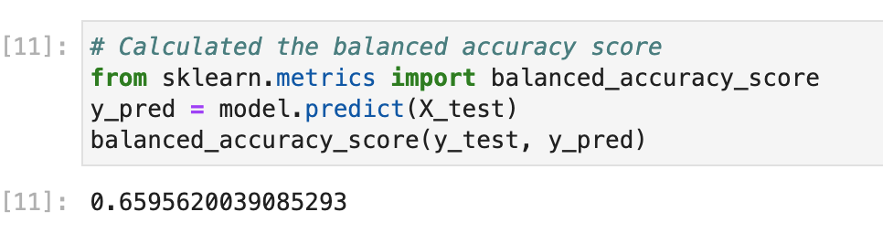
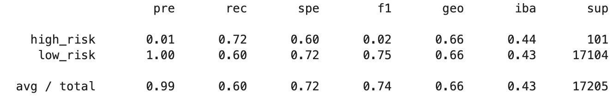
- Naive Random oversampling resulted in a balanced accuracy score of 65.9% with a precision rate 1% and recall of 72% for high risk scenarios.

### SMOTE Oversampling
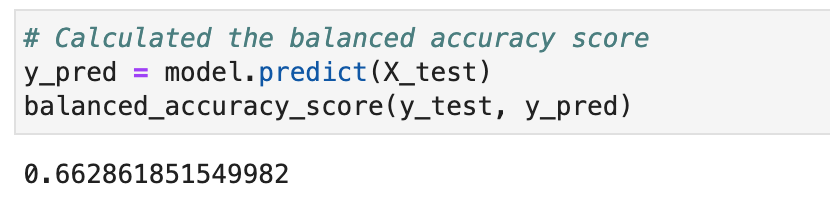
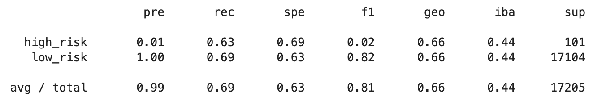
- SMOTE oversampling resulted in a balanced accuracy score of 66.2% with a precision rate 1% and recall of 63% for high risk scenarios.

### Undersampling
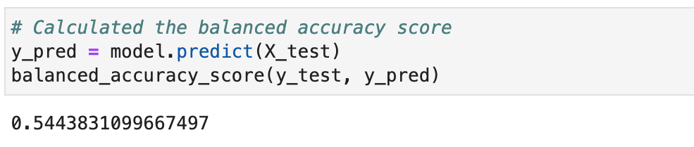
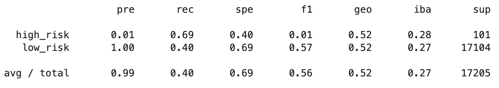
- Undersampling model resulted in a balanced accuracy score of 54.4% with a precision rate 1% and recall of 69% for high risk scenarios.

### SMOTEENN (combination over & undersampling)
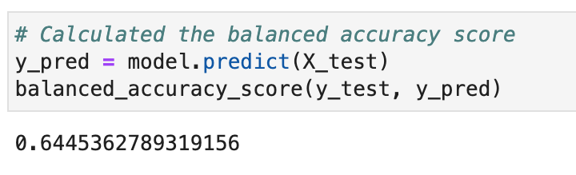
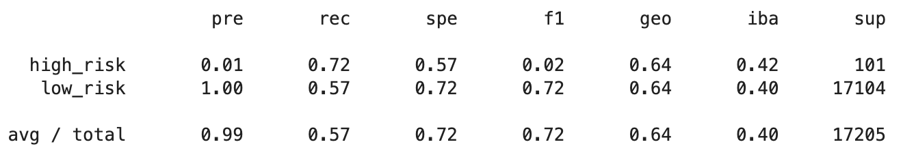
- The SMOTEEN model resulted in a balanced accuracy score of 64.4% with a precision rate 1% and recall of 72% for high risk scenarios.

### Balanced Random Forest Classifier
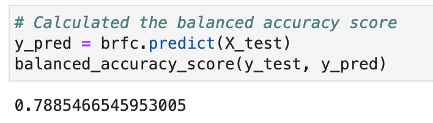
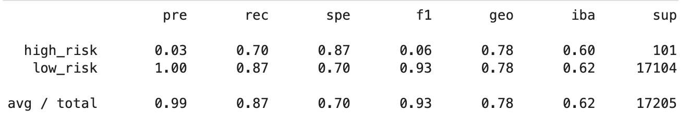
- The Random Forest model resulted in a balanced accuracy score of 78.8% with a precision rate 3% and recall of 70% for high risk scenarios.

### Easy Ensemble Classifier
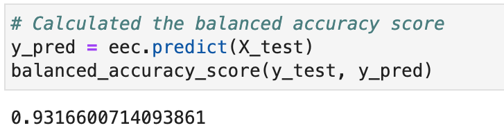
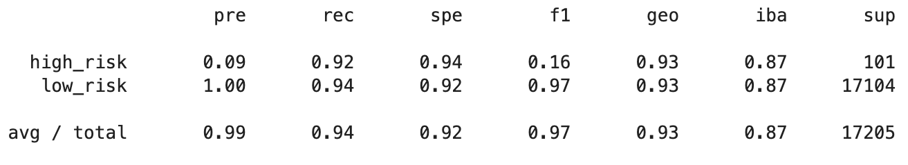
- The Random Forest model resulted in a balanced accuracy score of 93.2% with a precision rate 9% and recall of 92% for high risk scenarios.

## Summary
Of all of the models that we tested, the Balanced Random Forest and Easy Ensemble classifier models performed much better than the first 4 over and undersampling models. The Easy Ensemble model performed the best overall and would be my recommendation for use by the LendingClub due to the highest levels of precisions and recall in this model.  